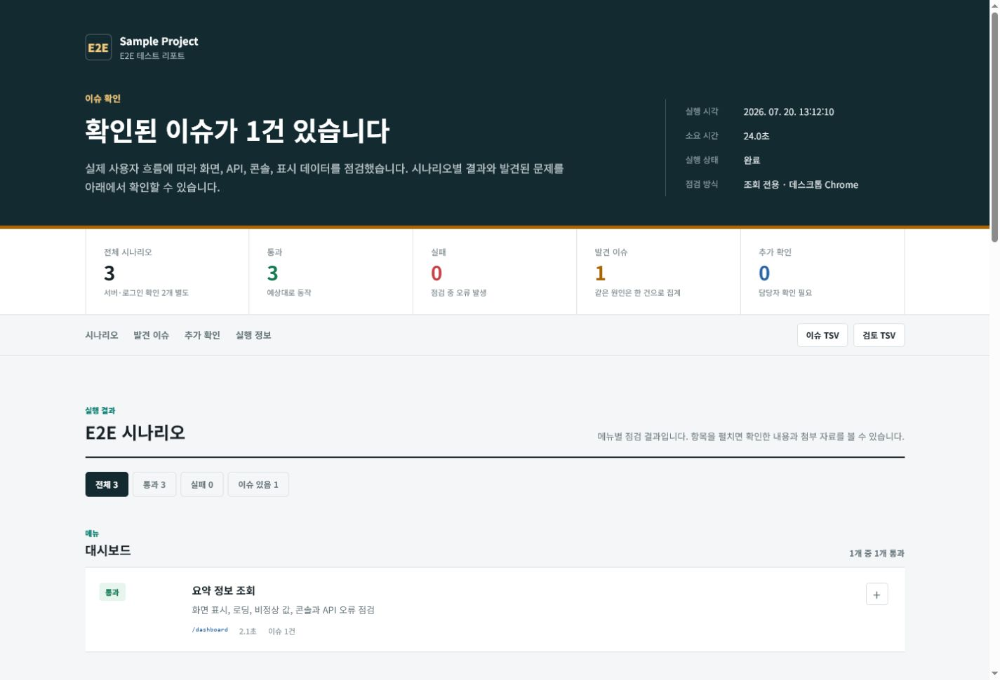

<div align="center">

# Agent E2E

**AI 에이전트와 함께 만들고, 한 장의 보고서로 확인하는 Playwright E2E 도구**


[](https://github.com/IncleRepo/agent-e2e/actions/workflows/validate.yml)


</div>

Agent E2E는 웹 서비스를 실제 사용자처럼 열어 보고 화면, API, 콘솔, 데이터 표출 문제를 찾는 도구입니다. Codex나 Claude 같은 AI 에이전트가 프로젝트를 조사하고 테스트를 작성하며, Playwright가 브라우저에서 같은 동작을 반복해서 검증합니다.

결과는 `reports/report.html` 하나에 모입니다. 테스트 코드를 몰라도 보고서를 위에서 아래로 읽으면 무엇을 검사했고, 무엇이 통과했고, 어디를 더 봐야 하는지 알 수 있습니다.



처음이라면 [처음부터 보고서까지](#처음부터-보고서까지)만 순서대로 따라가면 됩니다. 이후에는 [상황별 요청 예시](#상황별로-ai에게-부탁하는-방법)와 [문제 해결](#자주-막히는-지점)을 필요할 때 찾아보세요.

## 먼저 이것만 알아두세요

Agent E2E 안에 실제 서비스가 들어 있는 것은 아닙니다. 검사할 FE와 BE는 별도 저장소에서 실행 중이어야 합니다. 이 저장소는 브라우저를 열어 그 서비스를 점검하고 결과를 보고서로 만드는 역할을 합니다.

```text
내가 프로젝트 정보를 알려 줌
            ↓
AI 에이전트가 화면과 코드를 조사함
            ↓
프로젝트 프로필과 E2E 시나리오를 작성함
            ↓
Playwright가 실제 브라우저에서 검사함
            ↓
reports/report.html에서 결과를 확인함
```

처음에는 다음 네 가지만 준비하면 됩니다.

| 준비할 것 | 예시 | 잘 모르겠다면 |
| --- | --- | --- |
| 프로젝트 이름 | `billing-admin` | 영문 소문자와 `-`로 정하면 됩니다. |
| FE 소스 폴더 | `C:\work\billing-fe` | 프론트엔드 코드가 있는 폴더입니다. |
| BE 소스 폴더 | `C:\work\billing-be` | 백엔드 코드가 있는 폴더입니다. |
| 실행 주소 | FE `http://localhost:3000`, API `http://localhost:8080/api` | FE/BE 실행 담당자에게 물어보거나 AI에게 소스에서 찾아 달라고 요청할 수 있습니다. |

로그인이 필요한 서비스라면 테스트 계정도 필요합니다. 비밀번호는 채팅이나 Git에 올리지 않고 로컬 환경 파일에만 적습니다.

## 처음부터 보고서까지

아래 순서를 한 번만 따라 하면 됩니다. 명령은 모두 `agent-e2e` 폴더에서 실행합니다.

### 1. 저장소 받기

```powershell
git clone https://github.com/IncleRepo/agent-e2e.git
cd agent-e2e
```

이미 폴더를 받았다면 이 단계는 건너뜁니다.

### 2. 실행 도구 설치하기

Node.js 20 이상이 필요합니다. 설치 여부는 다음 명령으로 확인할 수 있습니다.

```powershell
node --version
npm --version
```

버전이 표시되면 필요한 패키지와 Chromium을 설치합니다.

```powershell
npm --prefix automation install
npm --prefix automation run browser:install
```

이 설치는 저장소를 처음 받았을 때 한 번만 하면 됩니다.

### 3. FE와 BE 실행 상태 확인하기

브라우저에서 FE 주소가 열리는지 확인합니다. API는 브라우저에서 예쁜 화면이 나오지 않아도 되지만, 서버가 실행 중이어야 합니다.

서버 실행 방법을 모르면 AI 에이전트에게 먼저 이렇게 요청합니다.

```text
FE와 BE 소스 경로를 확인해서 각각 어떻게 실행하는지 알려줘.
아직 파일은 수정하지 말고 필요한 Node, Java, 환경변수와 실행 명령만 정리해줘.
```

### 4. AI 에이전트에게 첫 설정 부탁하기

Codex나 Claude에서 이 저장소 폴더를 작업공간으로 연 뒤 아래 문장을 프로젝트에 맞게 바꿔 전달합니다.

```text
루트 AGENTS.md와 README.md를 먼저 읽어줘.

새 프로젝트 ID는 billing-admin이야.
FE 소스는 C:\work\billing-fe,
BE 소스는 C:\work\billing-be에 있어.
FE는 http://localhost:3000,
API는 http://localhost:8080/api에서 실행 중이야.

쓰기 동작은 제외하고 FE/BE 코드와 실제 화면을 조사해줘.
주요 메뉴, 화면 경로, API 호출을 파악해서 프로젝트 프로필과
읽기 전용 E2E 시나리오를 빠짐없이 만들어줘. FE 라우터의 정적 경로,
동적 상세, 검색, 필터와 탭, 페이지 이동, 다운로드, 핵심 API 계약,
권한별 접근을 각각 검사하거나 제외 이유를 남겨줘. 화면, API, 콘솔, 데이터 표출을 점검하고
마지막에 전체 테스트를 실행해서 report.html까지 생성해줘.
```

AI 에이전트는 보통 다음 순서로 작업합니다.

1. `AGENTS.md`와 안전 규칙을 읽습니다.
2. FE 라우터, 메뉴, API 호출부와 BE 구현을 살펴봅니다.
3. `automation/projects/billing-admin/`을 만듭니다.
4. URL과 로그인 방식, 화면 경로를 설정합니다.
5. 정적 경로와 동적 상세, 검색·필터·페이지·다운로드·API 계약을 대조해 E2E 시나리오로 작성합니다.
6. 설정과 TypeScript를 검사합니다.
7. Playwright를 실행하고 `reports/report.html`을 만듭니다.

중간에 등록, 수정, 삭제처럼 데이터가 바뀌는 동작이 필요하면 AI가 먼저 물어봐야 합니다. 승인하기 전에는 진행하지 않는 것이 기본 규칙입니다.

### 5. 로그인 정보 넣기

로그인이 필요한 경우 AI에게 환경 파일의 빈 틀만 만들어 달라고 요청할 수 있습니다.

```text
로그인 값은 내가 직접 넣을게. .env.e2e.local 파일에 필요한 환경변수 이름만 준비해줘.
```

직접 만들려면 예시 파일을 복사합니다.

```powershell
Copy-Item automation\.env.example automation\.env.e2e.local
```

그다음 `automation/.env.e2e.local`을 열어 로컬에서만 값을 채웁니다.

```dotenv
E2E_PROJECT=billing-admin
E2E_FE_URL=http://localhost:3000
E2E_API_URL=http://localhost:8080/api
E2E_LOGIN_ID=your-test-id
E2E_LOGIN_PASSWORD=your-test-password
E2E_FE_SOURCE=C:\work\billing-fe
E2E_BE_SOURCE=C:\work\billing-be
```

이 파일은 Git에서 자동으로 제외됩니다. 그래도 비밀번호, 토큰, 쿠키를 다른 문서나 테스트 코드에 적지 마세요.

### 6. E2E 실행하기

AI에게 실행을 요청해도 되고, 직접 명령을 입력해도 됩니다.

```text
billing-admin 전체 E2E를 실행하고 report.html을 열어줘.
실패가 있으면 테스트 문제인지 제품 문제인지 근거와 함께 구분해줘.
```

직접 실행할 때:

```powershell
npm --prefix automation run audit -- --project billing-admin
npm --prefix automation run report:open
```

`audit` 명령 하나가 프로젝트 설정 검사, 서버 연결, 로그인, 시나리오 실행, 보고서 생성을 차례로 처리합니다.

## 보고서는 이렇게 읽습니다

보고서는 실행할 때마다 `reports/report.html`에 새로 만들어집니다. 브라우저에서 위에서 아래로 읽으면 됩니다.

### 실행 요약

가장 위에서 전체 시나리오, 통과, 실패, 발견 이슈, 검토 필요 건수를 확인합니다.

- **통과**: 시나리오가 기대한 결과까지 완료됐습니다.
- **실패**: 화면 진입이나 사용자 동작을 끝내지 못했습니다.
- **발견 이슈**: 테스트는 끝났지만 화면, API, 콘솔 등에서 문제 근거를 찾았습니다.
- **검토 필요**: 느린 로딩처럼 환경이나 업무 기준을 더 확인해야 합니다.

따라서 `통과 10, 발견 이슈 1`처럼 보일 수도 있습니다. 브라우저 동작은 끝까지 수행됐지만 검사 도중 API 오류 한 건을 찾았다는 뜻입니다.

### E2E 시나리오

어떤 메뉴와 행동을 검사했는지 보여 줍니다. 항목 오른쪽의 `+` 버튼을 누르면 실행 시간, 최종 경로, 오류 내용, 스크린샷과 Trace를 볼 수 있습니다.

### 발견된 이슈

자동화가 수집한 문제를 FE, BE, API, 화면, 콘솔 같은 기준으로 정리합니다. 같은 원인은 한 건으로 묶고, 재현 경로와 판단 근거를 함께 보여 줍니다.

`이슈 TSV` 버튼을 누르면 기존 이슈 스프레드시트에 붙여 넣기 쉬운 형식으로 내려받을 수 있습니다.

### 추가 검토 필요

자동화만으로 결함이라고 단정하기 어려운 항목입니다. 실제 업무 기준이나 다른 환경에서도 같은지 사람이 확인한 뒤 이슈 등록 여부를 결정합니다.

### 실행 정보

테스트에 사용한 FE/API 주소와 서버 연결, 로그인 준비 결과를 확인할 수 있습니다.

## 상황별로 AI에게 부탁하는 방법

### 이미 연결된 프로젝트를 다시 검사할 때

```text
billing-admin의 기존 설정과 시나리오를 먼저 확인해줘.
전체 E2E를 다시 실행하고 지난 설정을 임의로 완화하지 말아줘.
report.html 기준으로 실패, 새 이슈, 검토 필요 항목을 정리해줘.
```

### 새 기능이 추가됐을 때

```text
billing-admin에 월별 보고서 조회 기능이 추가됐어.
관련 FE/BE 변경을 읽고 기존 시나리오로 충분한지 먼저 판단해줘.
부족하면 읽기 전용 E2E 시나리오를 추가하고 전체 회귀검사를 실행해줘.
```

화면의 버튼 위치나 내부 코드가 바뀌어도 사용자가 하는 행동과 결과가 같다면 기존 시나리오를 유지할 수 있습니다. 사용자 행동, URL, API 계약이 바뀌었을 때만 시나리오 수정이 필요합니다.

### 특정 문제만 확인할 때

```text
사용자 목록에서 검색 후 페이지를 이동하면 검색어가 초기화된다는 제보가 있어.
데이터를 바꾸지 않는 범위에서 재현 시나리오를 추가하고
화면 상태와 API 요청 파라미터를 함께 확인해줘.
```

### 보고서를 같이 분석할 때

```text
가장 최근 report.html을 읽고 초보자도 이해할 수 있게 설명해줘.
제품 이슈, 테스트 환경 문제, 추가 확인이 필요한 항목으로 나눠줘.
```

### 시나리오 현황만 정리할 때

```text
billing-admin에 현재 어떤 E2E 시나리오가 있는지
메뉴, 사용자 행동, 검증 내용 기준으로 쉽게 정리해줘. 실행은 하지 마.
```

## AI가 처리하는 일과 내가 결정하는 일

| AI 에이전트가 처리할 수 있는 일 | 사용자가 결정해야 하는 일 |
| --- | --- |
| FE/BE 구조와 메뉴 조사 | 어떤 프로젝트와 기능이 중요한지 |
| 프로젝트 프로필과 시나리오 작성 | 운영 데이터에 영향을 주는 동작을 허용할지 |
| Playwright 실행과 증거 수집 | 테스트 계정과 전용 데이터 제공 여부 |
| 화면/API/콘솔 문제의 원인 후보 조사 | 검토 필요 항목을 실제 이슈로 등록할지 |
| 보고서 생성과 결과 설명 | 발견된 제품 문제의 우선순위와 담당자 |

AI가 만든 테스트도 코드이므로 처음 연결할 때는 어떤 화면과 행동을 검사하는지 한 번 확인하는 편이 좋습니다. 이후에는 같은 시나리오를 반복 실행해 회귀 여부를 볼 수 있습니다.

처음 실행할 때 한 가지 전역 오류가 여러 시나리오에서 반복될 수 있습니다. AI는 근본 원인을 확인한 뒤 `known-issues.json`에 안정적인 오류 문구를 등록하고 다시 실행합니다. 그러면 오류가 사라지는 것이 아니라 보고서의 `발견 이슈` 한 건으로 묶이고, 나머지 시나리오도 끝까지 검사할 수 있습니다.

## 자주 쓰는 명령

모든 명령은 저장소 루트에서 실행합니다.

| 목적 | 명령 |
| --- | --- |
| 패키지 설치 | `npm --prefix automation install` |
| Chromium 설치 | `npm --prefix automation run browser:install` |
| 새 프로젝트 틀 생성 | `npm --prefix automation run project:init -- --project my-project` |
| 프로젝트 설정 검사 | `npm --prefix automation run validate -- --project my-project` |
| TypeScript 검사 | `npm --prefix automation run typecheck` |
| 전체 E2E 실행 | `npm --prefix automation run audit -- --project my-project` |
| 최근 보고서 열기 | `npm --prefix automation run report:open` |
| 프레임워크 자체 점검 | `npm --prefix automation run check` |

## 자주 막히는 지점

### `node` 또는 `npm` 명령을 찾을 수 없다고 나옵니다

Node.js 20 이상을 설치한 뒤 터미널을 새로 여세요. `node --version`과 `npm --version`이 모두 표시돼야 합니다.

### 브라우저 실행 파일이 없다고 나옵니다

다음 명령으로 Agent E2E가 사용할 Chromium을 설치합니다.

```powershell
npm --prefix automation run browser:install
```

### FE 또는 API 연결 검사에서 실패합니다

FE와 BE가 실행 중인지, `E2E_FE_URL`과 `E2E_API_URL`의 포트가 맞는지 확인합니다. 회사 VPN이나 방화벽이 필요한 서비스인지도 확인하세요.

### 로그인 단계에서 실패합니다

테스트 계정이 잠기지 않았는지, `.env.e2e.local`의 ID와 비밀번호가 맞는지 확인합니다. 로그인 화면이 바뀌었다면 AI 에이전트에게 선택자를 다시 조사해 달라고 요청합니다.

### `Read-only safety guard blocked write requests`가 나옵니다

일반 시나리오 도중 POST, PUT, PATCH, DELETE 요청이 발생했다는 뜻입니다. 곧바로 전체 허용하지 말고 어떤 요청인지 먼저 확인하세요. 로그인 이후의 토큰 갱신처럼 꼭 필요한 요청만 사용자 확인 후 정확한 경로로 허용합니다.

### 보고서가 만들어지지 않습니다

터미널에서 처음 발생한 오류를 확인합니다. 프로필 검증이나 서버 준비 단계에서 중단됐다면 해당 문제를 먼저 해결해야 합니다. AI에게 터미널 오류를 읽고 원인을 구분해 달라고 요청해도 됩니다.

## 용어가 낯설다면

| 용어 | 뜻 |
| --- | --- |
| E2E | 사용자가 서비스를 쓰는 전체 흐름을 브라우저에서 확인하는 테스트 |
| 시나리오 | 로그인, 검색, 상세 조회처럼 자동화가 따라 할 한 가지 사용자 행동 |
| 프로젝트 프로필 | 서비스 URL, 로그인 방식, 화면 경로를 모아 둔 설정 |
| 회귀검사 | 이전에 되던 기능이 변경 뒤에도 계속 되는지 다시 확인하는 검사 |
| Trace | 실패 당시 브라우저 동작과 네트워크를 다시 살펴볼 수 있는 Playwright 기록 |
| 읽기 전용 | 데이터를 등록·수정·삭제하지 않고 조회 중심으로 검사하는 방식 |
| 알려진 이슈 | 이미 알고 있어 실행할 때마다 새 이슈로 중복 등록하지 않을 문제 |

## 저장소 구조

```text
agent-e2e/
├─ reports/                 가장 최근 통합 보고서
├─ automation/
│  ├─ core/                 실행·진단·안전·보고서 공통 엔진
│  ├─ core-tests/           서버와 로그인 사전 점검
│  ├─ projects/             프로젝트별 프로필과 시나리오
│  ├─ docs/                 운영 기준과 작성 규칙
│  └─ scripts/              초기화·검증·실행 명령
├─ AGENTS.md                모든 AI 에이전트가 따르는 기준
├─ CLAUDE.md                Claude 진입 파일
└─ README.md
```

프로젝트별 차이는 `automation/projects/<project-id>/`에만 둡니다. 공통 엔진에 특정 서비스 이름이나 API 경로를 섞지 않아야 여러 팀이 같은 저장소를 업데이트해서 쓸 수 있습니다.

## 더 자세한 문서

| 문서 | 언제 읽으면 좋은가 |
| --- | --- |
| [프로젝트 온보딩](automation/docs/PROJECT_ONBOARDING.md) | 새 프로젝트를 처음 연결할 때 |
| [시나리오 작성 기준](automation/docs/SCENARIO_STANDARD.md) | 고유 사용자 흐름을 추가할 때 |
| [안전 규칙](automation/docs/SAFETY_RULES.md) | 로그인을 포함한 쓰기 요청을 다룰 때 |
| [보고서 기준](automation/docs/REPORT_STANDARD.md) | 결과가 어떻게 집계되는지 확인할 때 |
| [구조 원칙](automation/docs/ARCHITECTURE.md) | 공통 엔진을 수정하려 할 때 |

## Git에 올리지 않는 것

인증정보와 실제 실행 결과는 각자 로컬에만 남습니다.

- `automation/.env.e2e.local`
- `automation/projects/*/.auth/`
- `reports/report.html`
- `reports/evidence/`
- `automation/node_modules/`

프로젝트 프로필과 시나리오는 공유하되 비밀번호, 토큰, 쿠키, 개인정보는 공유하지 않습니다. 채팅 작업이 끝나도 작성된 프로필과 테스트는 저장소에 남으므로, 다른 사람이 클론하거나 새 AI 작업을 열어도 같은 기준으로 이어서 사용할 수 있습니다.

## 라이선스

이 프로젝트는 [MIT License](LICENSE)로 공개합니다. 라이선스 조건에 따라 자유롭게 사용하고 수정하며 배포할 수 있습니다.
